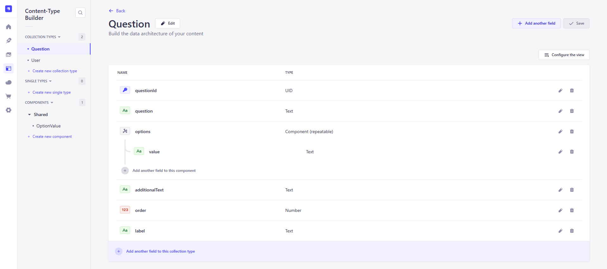
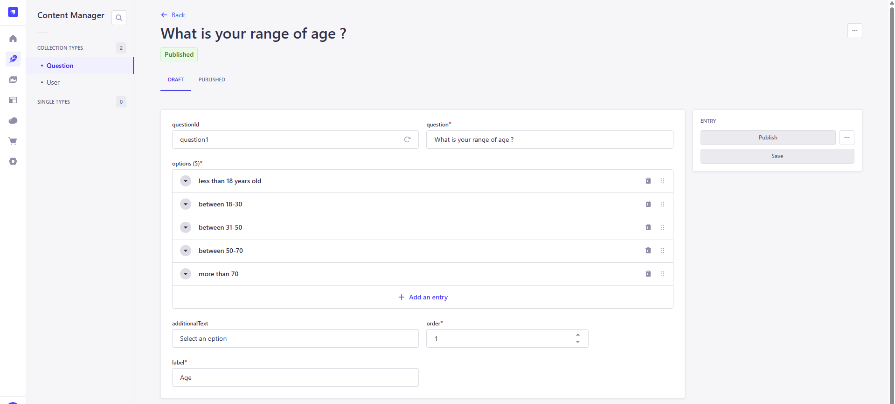

# Question workflow app
This is a full-stack project. The backend is built with [Strapi](https://docs.strapi.io/) and the frontend is built with [React + Vite](https://vite.dev/guide/)

It allows admin users who have access to the Strapi Admin panel can define a collection of questions and possible answers. 
Then on the frontend a workflow of questions is presented to the end-user who is able to select its answer.

### Backend built with Strapi

Strapi is a headless CMS. In this case, it is used to define the schema of a question :

And it allows admin users of teh Strapi admin panel to quickly provide data entries

Data entries are then available for read on the following endpoint : `/api/questions`

### Frontend built with React + Vite

The workflow of questions are displayed to the end-users which can interact with the UI to provide its answers.

This project is using React, Redux and Redux toolkit to demonstrate state management.

