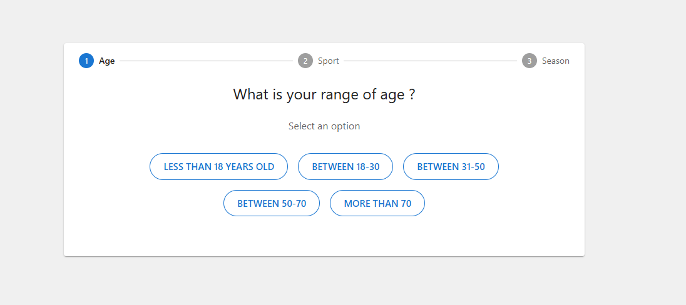
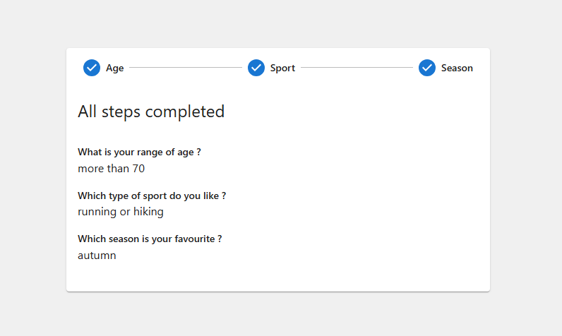
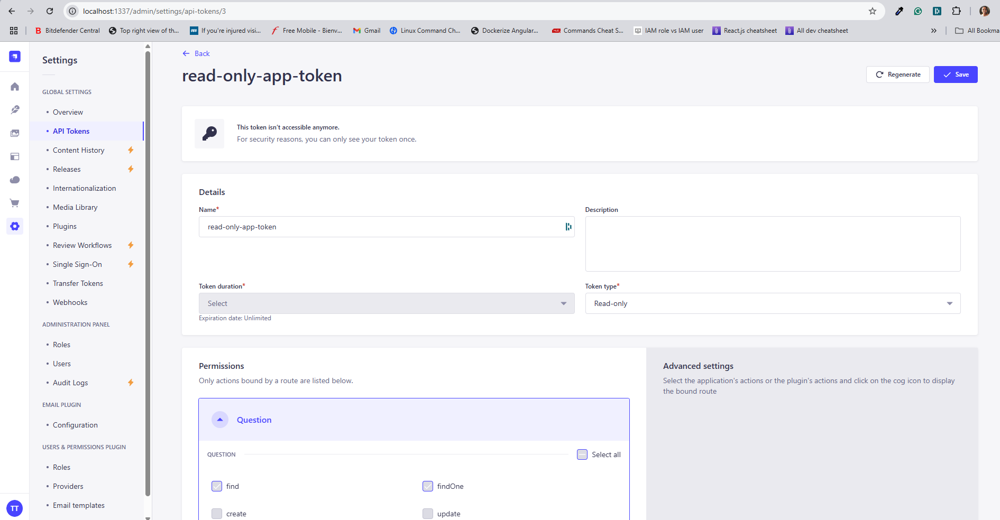

# Question workflow app
This project works in conjunction with [question-workflow-backend-app](https://github.com/lrasata/question-workflow-backend-app) where admin users who have access to the Strapi Admin panel can define a collection of questions and possible answers.
This frontend presents the workflow questions to the end-user who is able to select its answers.


### Frontend built with React + Vite

The workflow of questions is displayed to the end-users which can interact with the UI to provide its answers.

This project is using **React, Redux and Redux toolkit** to demonstrate state management.





## Prerequisites
To run this app you have to generate an API token from your running Strapi instance on the Admin panel which have to be provided in the `.env`

API token allows read access for the API endpoint of the backend. [Learn More](https://docs.strapi.io/dev-docs/configurations/api-tokens)



```
VITE_BACKEND_URL=http://localhost:1337/api/questions
VITE_BACKEND_API_KEY=your_token
```

## Installation and Setup Instructions

You will need `node` and `npm` installed globally on your machine.

Installation:

`npm install`


To Start Server:

`npm run dev`

To Visit App:

`http://localhost:5173/`

### `deploy`

For testing purposes, this project was successfully deployed on AWS following this [step by step guide](https://vanu-verma.medium.com/publish-a-vitejs-react-web-app-to-production-using-ec2-and-apache2-ec86a61c5e17).
The project was deployed on `AWS EC2 instance` and was able to reach the backend deployed on another EC2 instance to fetch data.
