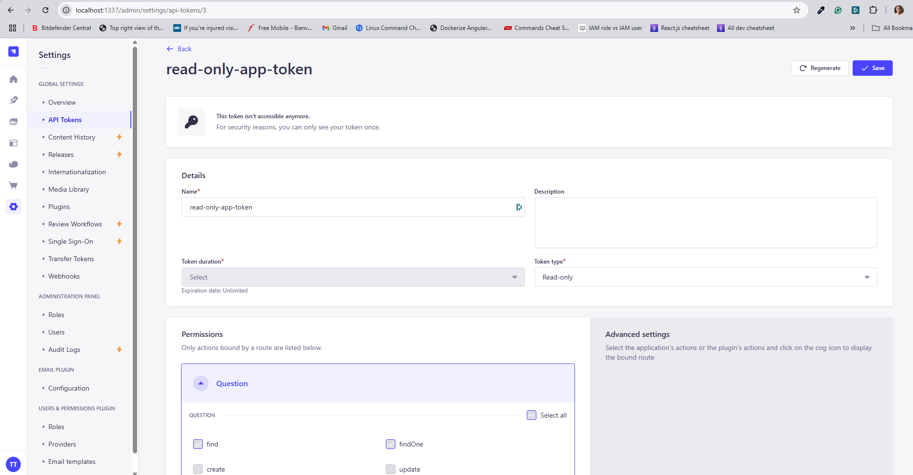

# This is a React + TypeScript + Vite project

## Prerequisites
To run this app you have to generate an API token from your running Strapi instance on the Admin panel which have to be provided in the `.env`

API token allows read access for the API endpoint of the backend. [Learn More](https://docs.strapi.io/dev-docs/configurations/api-tokens)



```
VITE_BACKEND_URL=http://localhost:1337/api/questions
VITE_BACKEND_API_KEY=your_token
```

## Installation and Setup Instructions

You will need `node` and `npm` installed globally on your machine.

Installation:

`npm install`


To Start Server:

`npm run dev`

To Visit App:

`http://localhost:5173/`